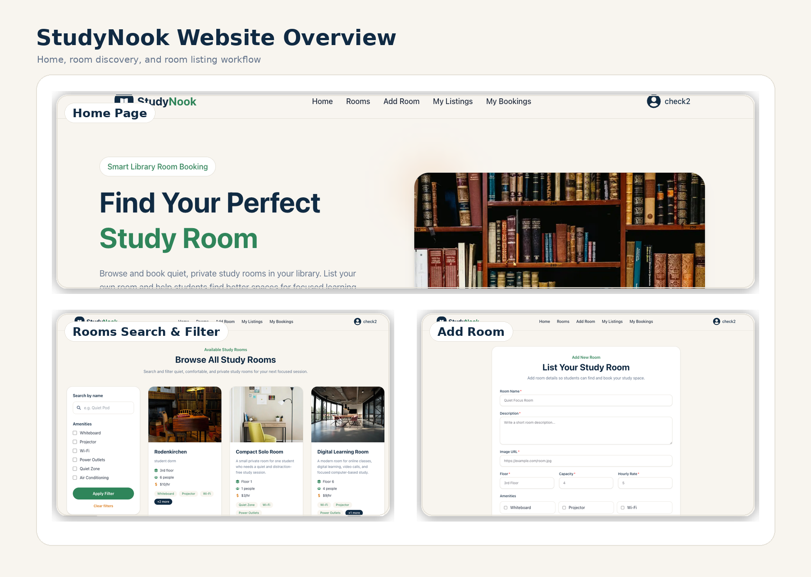
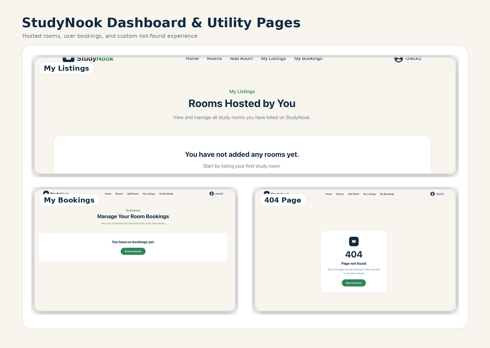

# 📚 StudyNook – Library Study Room Booking Platform

**Live Website:** https://study-nook-client-chi.vercel.app  
**Server API:** https://study-nook-server-seven.vercel.app  

StudyNook is a full-stack library study room booking platform where users can browse, search, filter, list, book, and manage private study rooms. It includes authentication, protected routes, room CRUD operations, booking conflict prevention, user-specific dashboards, and a clean responsive interface.

---

## 🌟 Project Preview

### Website Overview



### Dashboard, Forms and Utility Pages



---

## ✨ Key Features

- 🔍 **Search and Filter Rooms**  
  Users can search study rooms by room name and filter rooms by amenities such as Wi-Fi, Projector, Whiteboard, Quiet Zone, Power Outlets, and Air Conditioning.

- 🏫 **Room Listing System**  
  Logged-in users can add their own study rooms with image, description, floor, capacity, hourly rate, and amenities.

- 📅 **Smart Booking System**  
  Users can book a room by selecting date, start time, and end time. The total cost is calculated automatically based on booking duration and hourly rate.

- 🚫 **Booking Conflict Prevention**  
  The backend checks existing confirmed bookings and prevents overlapping reservations for the same room and time slot.

- 🧑‍💼 **Owner Room Management**  
  Room owners can update and delete only the rooms they created.

- 📋 **My Bookings Dashboard**  
  Users can view their own bookings, check booking status, and cancel future confirmed bookings.

- 🔐 **JWT Protected Private Routes**  
  Private actions such as adding rooms, booking rooms, updating rooms, deleting rooms, viewing listings, viewing bookings, and cancelling bookings are protected using Better Auth JWT.

- 🔔 **Toast Notifications**  
  All success and error messages are shown using toast notifications. No default browser alert is used.

- 📱 **Responsive Design**  
  The website is responsive and works well on desktop, tablet, and mobile screens.

---

## 🧩 Pages Included

- Home
- All Rooms
- Room Details
- Add Room
- My Listings
- My Bookings
- Login
- Register
- Custom 404 Not Found Page

---

## 🛠️ Technologies Used

### Frontend

- Next.js
- React
- Tailwind CSS
- HeroUI
- React Icons
- React Hot Toast
- Better Auth
- Gravity UI Icons

### Backend

- Node.js
- Express.js
- MongoDB
- JWT Verification
- CORS
- dotenv

### Database

- MongoDB Atlas

### Deployment

- Frontend: Vercel
- Backend: Vercel
- Database: MongoDB Atlas

---

## 📌 Dependencies

### Client Dependencies

```bash
npm install next react react-dom
npm install @heroui/react
npm install react-icons
npm install react-hot-toast
npm install better-auth
npm install @gravity-ui/icons