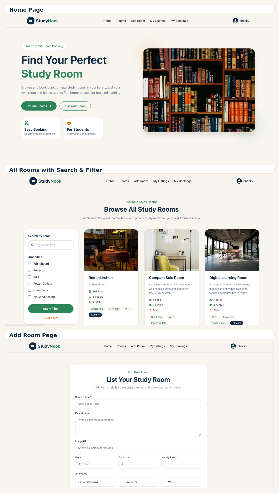
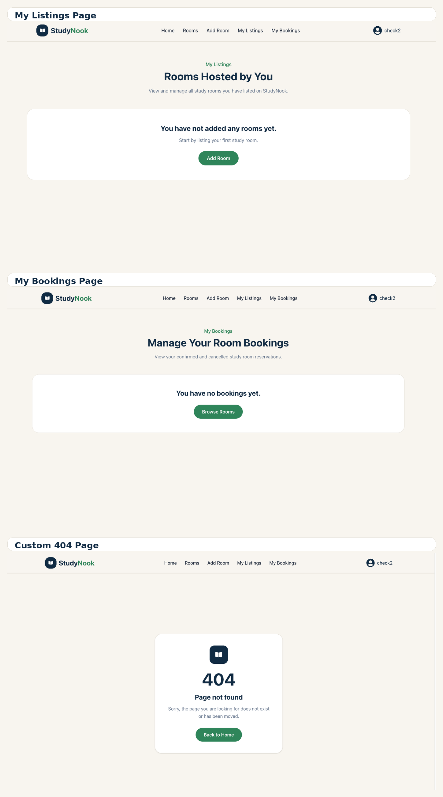

# StudyNook – Library Study Room Booking

Live Site: https://study-nook-client-chi.vercel.app

StudyNook is a full-stack study room booking web application where students and library users can browse, search, filter, list, and book private study rooms. Room owners can manage their own listings, and users can handle their bookings from a private dashboard.

## Website Preview

### Main Pages



### Dashboard and Utility Pages



## Key Features

- Users can browse all available study rooms with search and amenity-based filtering.
- Authenticated users can add their own study room listings.
- Room owners can update and delete only their own rooms.
- Users can book rooms by selecting a date, start time, and end time.
- The booking system prevents overlapping bookings for the same room and time slot.
- Users can view and cancel their own bookings from the My Bookings page.
- JWT authentication is implemented using Better Auth with protected private routes.
- The application uses toast notifications instead of default browser alerts.
- Custom loading states and a custom 404 page are included.
- Fully responsive design for mobile, tablet, and desktop devices.

## Technologies Used

### Frontend

- Next.js
- React
- Tailwind CSS
- HeroUI
- React Hot Toast
- React Icons
- Better Auth

### Backend

- Node.js
- Express.js
- MongoDB
- JWT verification
- CORS
- dotenv

## Main Pages

- Home
- Rooms
- Room Details
- Add Room
- My Listings
- My Bookings
- Login
- Register
- Custom 404 Page

## Authentication

StudyNook supports email/password authentication and Google login using Better Auth. Private actions such as adding rooms, booking rooms, updating rooms, deleting rooms, viewing user bookings, and cancelling bookings are protected with JWT-based authentication.

## Booking Logic

The application checks booking conflicts before creating a new booking. If a room already has a confirmed booking for an overlapping time slot, the user cannot book that same room during that time.

## Environment Variables

### Client

```env
NEXT_PUBLIC_API_URL=your_backend_url
NEXT_PUBLIC_BETTER_AUTH_URL=your_frontend_url
BETTER_AUTH_URL=your_frontend_url